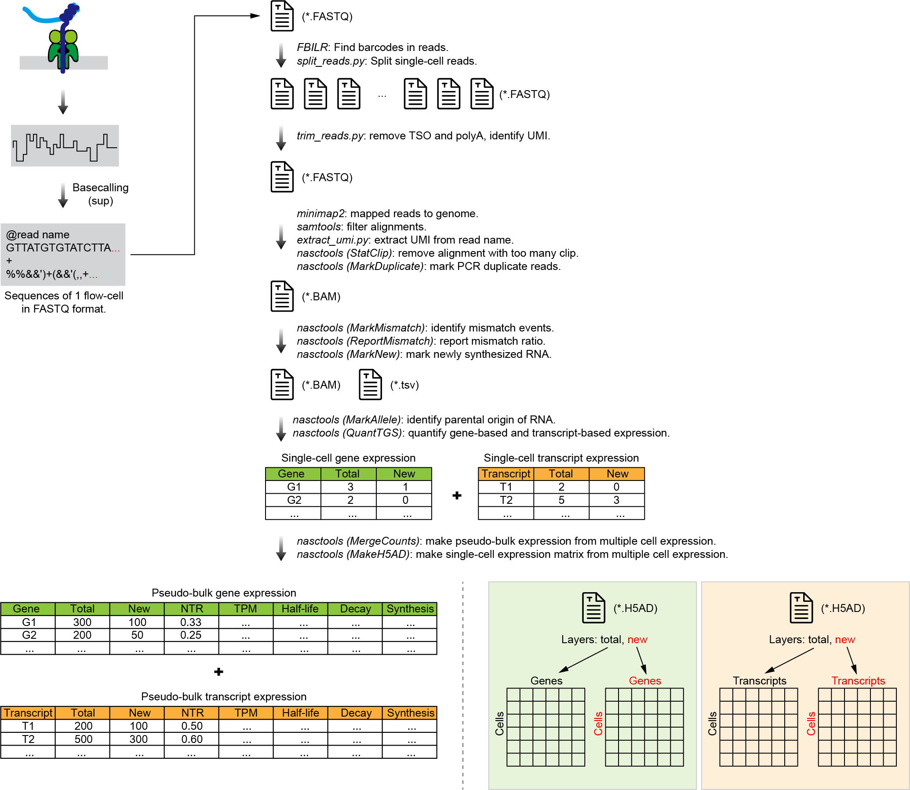

# Analysis of NanoNASC-seq

This directory contains the **Snakemake** Pipeline (\*.smk) and **Jupyter Notebook** (\*.ipynb) for the analysis of **NanoNASC-seq** datasets (PRJNA1103155).

| File | Type | Description |
| :- | :- | :- |
| 0_SnakeCommon.smk | Snakemake | Snakemake file. |
| 1_SnakeQC.smk | Snakemake | Snakemake file. |
| 2_SnakeDemux.smk | Snakemake | Snakemake file. |
| 3_SnakeMapping.smk | Snakemake | Snakemake file. |
| 4_SnakeMismatch.smk | Snakemake | Snakemake file. |
| 5_SnakeExpression.smk | Snakemake | Snakemake file. |
| nb_1_summary.ipynb | Jupyter Notebook | Jupyter Notebook file. |

## Workflow

Run the following commands step by step to reproduce the analysis process.

    snakemake -s 1_SnakeQC.smk -j
    snakemake -s 2_SnakeDemux.smk -j
    snakemake -s 3_SnakeMapping.smk -j
    snakemake -s 4_SnakeMismatch.smk -j
    snakemake -s 5_SnakeExpression.smk -j

Schematic of the workflow:

