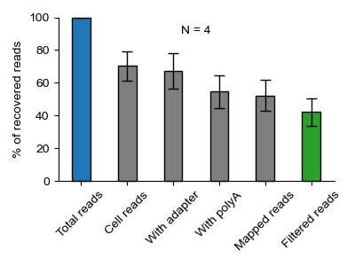

# Analysis of SCAN-seq2 datasets

This repository contains the `Snakemake` workflow to analyze the SCAN-seq2 datasets and statistics of the Nanopore-based single-cell RNA sequencing technology yield.

## Datasets

The 4 datasets were download from GEO under accession GSE203561 (High-throughput and high-sensitivity full-length single-cell RNA-seq analysis on third-generation sequencing platform, https://www.ncbi.nlm.nih.gov/geo/query/acc.cgi?acc=GSE203561). 

The information of the datasets were show below:

| Name | Sample | Run | AvgSpotLen | Platform | Species | Description | 
| :- | :- | :- | :- | :- | :- | :- |
| SRR19279042_SCANseq2_UMI200 | GSM6176325 | SRR19279042 | 2,758 | PromethION | Homo sapiens, Mus musculus | SCAN-seq2 UMI_200 library of 96 K562 cells and 96 3T3 cells |
| SRR19279044_SCANseq2_UMI100 | GSM6176324 | SRR19279044 | 2,505 | PromethION | Homo sapiens, Mus musculus | SCAN-seq2 UMI_100 library of 48 K562 cells and 48 3T3 cells |
| SRR19279045_SCANseq2_4CL | GSM6176323 | SRR19279045 | 1,361 | PromethION | Homo sapiens, Mus musculus | SCAN-seq2 4CL library of 2 human cell lines and 2 mouse cell lines |
| SRR19279047_SCANseq2_9CL | GSM6176321 | SRR19279047 | 1,259 | PromethION | Homo sapiens, Mus musculus | 9CL: Mix of 6 human cell line and 3 mouse cell line |

## Pipelines

The pipeline includes 3 steps described as follows:

 - Step 1: Download SRA files, and converted to FASTQ files.

   snakemake -s 1_SnakePrepare.smk -j --rerun-triggers mtime --use-conda --conda-not-block-search-path-envvars

 - Step 2: Demultiplexing single-cell reads and extract cDNA sequences. We adopt pipeline in https://github.com/liuzhenyu-yyy/SCAN-seq2 into `Snakemake`.

   snakemake -s 2_SnakeDemux.smk -j --rerun-triggers mtime --use-conda --conda-not-block-search-path-envvars

 - Step 3: Mapping the clean reads to genome (Homo sapiens or Mus musculus).

   snakemake -s 3_SnakeMapping.smk -j --rerun-triggers mtime --use-conda --conda-not-block-search-path-envvars

 - Step 4: Transcriptomic assembly.

   snakemake -s 4_SnakeAssembly.smk -j --rerun-triggers mtime --use-conda --conda-not-block-search-path-envvars

## Results

Yield of sequencing data

Summary:

    Mean:
    TotalRatio              100.000000
    PolyARatio               43.255731
    AdapterRatio             29.875306
    MergedFullRatio          13.132245
    UmitoolsExtractRatio     10.115523
    MappedRatio               7.630489
    FilteredRatio             7.345930

    Std:
    TotalRatio               0.000000
    PolyARatio              10.214190
    AdapterRatio             6.549523
    MergedFullRatio          3.147468
    UmitoolsExtractRatio     3.271037
    MappedRatio              2.746715
    FilteredRatio            2.644300

## References

Liao, Y., Liu, Z., Zhang, Y., Lu, P., Wen, L., & Tang, F. (2023). High-throughput and high-sensitivity full-length single-cell RNA-seq analysis on third-generation sequencing platform. Cell Discovery, 9(1), 5. https://doi.org/10.1038/s41421-022-00500-4
